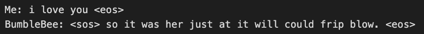
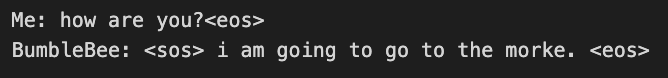

# 🧠 Transformer

_Transformer-encoder-based ChatBot_  

---

## 📝 Overview
- NanoChatBot, with ~2M parameters

---

## 🗂️ Repository Structure
- BumbleBee.py contains the model definition
- ChatBot.ipynb is used for the inference step
- To run it: *python BumbleBee.py* for training, open ChatBot.ipynb for chatting

--- 

## 📊 Results

  
  
*Conversations with Bumblebee*

